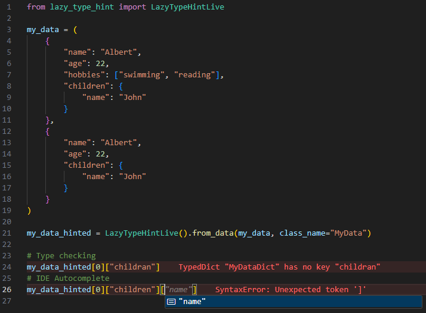
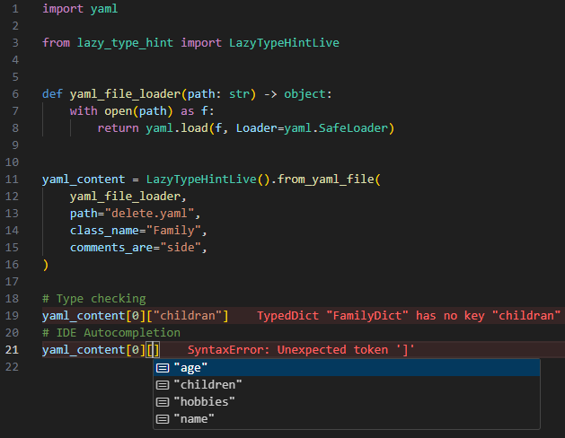

# Introduction

The user can interact this tool via two main APIs:

- [Live API](live_api.md)
- [Standard API](standard_api.md)

However, the end purpose is still the same: generating type hint information that can be
used by IDEs and type checkers. Both APIs follow a common structure:

```py
from lazy_type_hint import LazyTypeHint, LazyTypeHintLive

obj_typed = LazyTypeHintLive(<CONFIGURATION>).from_**(<PARAMS>)
```

1. Configuration will allow the user to fine-tune the way type information is generated.
   More information can be seen [here](configuration.md)
2. After the tool has been instantiated, any of the `from_*` methods are available
   depending on the type of input data that you want to type hint. More details are given in section below.

## Valid input data

This section explains different types of data that can be used as input to the tool. Be
aware that, although they are written with the `Live API` for the sake of simplicity, all
of these functionalities are also available within the `Standard API`. These are:

### From data

User can give any Python-based data structure as input:

=== "Python code"

    ```py
    from lazy_type_hint import LazyTypeHintLive

    my_data = (
        {
            "name": "Albert",
            "age": 22,
            "hobbies": ["swimming", "reading"],
            "children": {
                "name": "John"
            }
        },
        {
            "name": "Albert",
            "age": 22,
            "children": {
                "name": "John"
            }
        }
    )

    my_data_hinted = LazyTypeHintLive().from_data(my_data, class_name="MyData")
    ```

=== "Type information generated"

    Since we are using the `Live API` for this example, this is the corresponding
    generated file that has been generated and stored in the cache-based folder:

    ```py
    from typing import TypedDict
    from typing_extensions import NotRequired, TypeAlias


    class MyDataDictChildren(TypedDict):
        name: str


    class MyDataDict(TypedDict):
        name: str
        age: int
        hobbies: NotRequired[list[str]]
        children: MyDataDictChildren

    MyData: TypeAlias = tuple[MyDataDict, MyDataDict]
    ```

=== "Result"

    

### From yaml file

This tool internally implements its own YAML parser. This can be helpful to embed already
existing comments within the YAML file and include them as part of documentation within
the generated types.

=== "Input YAML File"

    ```yaml
    ---
    - name: Albert  # Name of the parent
    age: 22  # Age of the person
    hobbies: [swimming, reading]  # Possible hobbies
    children:  # Children that the parent have
        name: John

    - name: Albert
    age: 22
    children:
        name: John
    ```

=== "Python code"

    ```py
    import yaml

    from lazy_type_hint import LazyTypeHintLive


    def yaml_file_loader(path: str) -> object:
        with open(path) as f:
            return yaml.load(f, Loader=yaml.SafeLoader)


    yaml_content = LazyTypeHintLive().from_yaml_file(
        yaml_file_loader,
        path="file.yaml",
        class_name="Family",
        comments_are="side",
    )
    ```

=== "Type information generated"

    Observe how the comments of the YAML file were also parsed as docstrings.

    Since we are using the `Live API` for this example, this is the corresponding
    generated file that has been generated and stored in the cache-based folder.

    ```py
    from typing import TypedDict
    from typing_extensions import NotRequired, TypeAlias


    class FamilyDictChildren(TypedDict):
        name: str


    class FamilyDict(TypedDict):
        name: str
        """Name of the parent."""
        age: int
        """Age of the person."""
        children: FamilyDictChildren
        """Children that the parent have."""
        hobbies: NotRequired[list[str]]
        """Possible hobbies."""

    Family: TypeAlias = list[FamilyDict]
    ```

=== "Result"

    