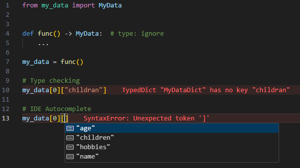

# Standard API

The Standard API facilitates the generation of type hints and allows exporting them as
standard `.py` files.

For detailed guidance on fine-tuning type information, refer to the
[Configuration](./configuration.md) section.

## How to use it?

You can provide input data for type hinting either as a Python object or by loading it
from a YAML file:

=== "From a Python object"

    ```py
    from lazy_type_hint import LazyTypeHint

    my_data = (
        {
            "name": "Albert",
            "age": 22,
            "hobbies": ["swimming", "reading"],
            "children": {
                "name": "John"
            }
        },
        {
            "name": "Albert",
            "age": 22,
            "children": {
                "name": "John"
            }
        }
    )

    LazyTypeHint().from_data(my_data, class_name="MyData").to_file("my_data.py")
    ```

=== "From a YAML file"

    Keep in mind that when information is loaded from a YAML file, comments starting with
    `#` are parsed and used as docstrings for the corresponding data structures.

    ```py
    import yaml

    from lazy_type_hint import LazyTypeHintLive


    def yaml_file_loader(path: str) -> object:
        with open(path) as f:
            return yaml.load(f, Loader=yaml.SafeLoader)


    yaml_content = LazyTypeHintLive().from_yaml_file(
        yaml_file_loader,
        path="file.yaml",
        class_name="MyData",
        comments_are="side",
    )
    ```

The code above will generate the following type interface, named `MyData`, and save it to
`my_data.py`:

```py
from typing import TypedDict
from typing_extensions import NotRequired, TypeAlias


class MyDataDictChildren(TypedDict):
    name: str


class MyDataDict(TypedDict):
    name: str
    age: int
    hobbies: NotRequired[list[str]]
    children: MyDataDictChildren

MyData: TypeAlias = tuple[MyDataDict, MyDataDict]
```

With this generated type information, `MyData` can now be used to type-hint any compatible
data structure:

{: .center}

## What are some of its potential use-cases?

- **Data Structure Interface Generation**: Complex data structures can be difficult and
  time-consuming to type-hint manually. This tool generates these interfaces in
  milliseconds, saving significant development effort.
- **Data Structure Validation**: The tool generates type information that defines the
  underlying structure of a dataset. This feature allows exporting the results as a string
  and comparing whether two objects share the same data structure, while ignoring value
  differences.
- **Static Validation**: Having detailed type information enables type checkers to perform
  more accurate validations, ensuring type consistency across a data structure and its
  usage.
- **Enhanced Development Workflow**: Generated type information is recognized by IDEs,
  providing autocompletion and simplifying access to complex data structures.